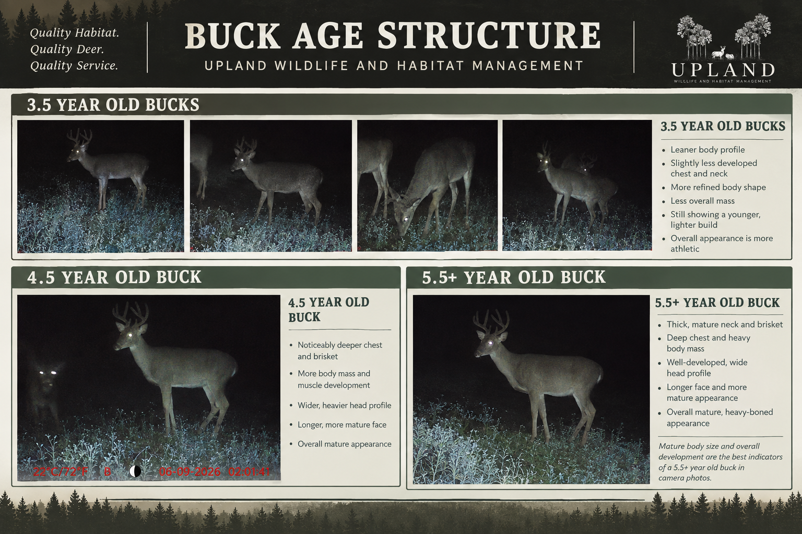

# Digital Buck Book — Product Requirements Document

**Status:** Core workflow deployed and live admin/public QA passed; direct client-account QA and legacy media cutover pending

**Updated:** 2026-09-27

**Product:** Upland Wildlife Management admin and client portals

## Overview

Digital Buck Book replaces the current Buck book, buck galleries, deer-image review, camera-batch upload, and annual camera-survey photo/counting experiences with one workflow for curating and publishing bucks. An administrator creates a book for a client property and survey year, chooses one highlight image for each buck that belongs in the printed book, adds any number of supporting images, orders the bucks, and publishes the digital book. Each buck has a stable detail page and a downloadable QR code for the printed page. Readers can browse the book's highlight images and open a buck to view its other photos.

The printed book and digital book contain exactly the same selected bucks and highlight images at export time. The app supplies print assets for layout elsewhere; it does not generate a print-ready book. A published buck's QR page opens without sign-in and lets the visitor browse the entire published book for that property and year.

**Confirmed product decisions:** QR scans open the full published book without a client login, starting on the scanned buck. Only print-selected bucks appear in the digital book. The app exports highlight images, QR codes, and page information for external print layout. JPEG, PNG, WebP, HEIC, and common camera RAW originals up to 50 MB each are supported; the app automatically creates web-friendly versions without a separate crop workflow. Published edits appear immediately. Historical Camera survey PDFs stay in Reports.

## Problem statement

The current workflow spreads related work across Buck book documents, galleries, camera uploads, image review, and survey pages. An administrator cannot curate one authoritative set of bucks and highlight images for a year's printed book, then use that same set as a navigable digital book. A reader of the printed book also lacks a predictable buck-specific destination for additional photos.

## Goals and success measures

1. An administrator can create, preview, and publish one digital book per property and survey year without using any of the legacy camera or Buck book tools.
2. Every published buck has exactly one highlight image, zero or more additional images, a stable detail URL, and a QR code that resolves to that buck.
3. The digital book shows exactly the bucks selected for the printed book, in the administrator's chosen order. The highlight image shown digitally matches the one selected for print.
4. An authenticated client or signed-out QR visitor can move from a buck to the full published book, browse every selected buck and its additional photos, and return to the starting buck on desktop and mobile.
5. Release QA confirms that 100% of generated QR codes resolve to the correct published buck and that draft or removed bucks are inaccessible to readers.

**Launch measurement:** Track books published, bucks published per book, additional images per buck, and successful buck-detail opens from QR links. Set adoption and speed targets after the first production book establishes a baseline.

## Users and use cases

- **Administrator:** “I want to organize this year's bucks for a property, choose the image that goes in print, add supporting photos, and publish the same sequence online.”
- **Administrator:** “I want a QR code for each selected buck so I can place it on that buck's printed page and verify its destination before printing.”
- **Client:** “I want to browse the highlighted bucks, open one buck's page, and swipe through the additional photos without losing my place in the book.”
- **Print reader:** “I want to scan a buck's QR code, see its additional photos, and explore the rest of that year's book without creating an account.”
- **Administrator:** “I want to revise a buck's photos after publication without breaking a QR code already printed.”

## Functional requirements

### P0 — Must have

1. **Book ownership and year.** The system allows an administrator to create at most one book for each client property and survey year. The admin workspace provides a Digital Buck Book page scoped to the selected property and year. A book has Draft and Published states.
2. **Buck records and page information.** The administrator can create, rename, reorder, and remove bucks within a book. Each buck has a required display name or identifier and an immutable internal ID. The administrator can enter an age class (for example, 3.5, 4.5, or 5.5+ years) and short field observations as bullet points. The app never infers an age from a photo. Two bucks may have the same display name without sharing a URL or QR destination.
3. **Highlight and supporting images.** The administrator can upload multiple JPEG, PNG, WebP, HEIC, or common camera RAW images directly to a buck, designate exactly one as its highlight, add or remove supporting images, and reorder them. The highlight appears first in the buck's image viewer. The system preserves each original and creates browser-compatible renditions automatically. An image is publishable only after its web rendition succeeds; the system prevents publishing a buck without a valid highlight image.
4. **Print selection.** The administrator can mark which bucks belong in the printed and digital book, change their order, and review the selected count. The published digital book contains exactly the print-selected bucks; it cannot contain extra digital-only bucks. Unselected bucks remain in the admin workspace but do not appear in the published book or public navigation. The system does not impose a fixed buck count; the administrator chooses the number for each year.
5. **Digital book.** The published book displays one highlight image and name per selected buck in print order. Selecting a buck opens its detail page. The detail page displays the highlight first, provides previous/next controls for additional photos, and has an obvious route back to the book. When present, the age class and field observations appear on the buck page. The interface supports keyboard, touch, and screen-reader navigation.
6. **Buck-specific QR codes.** The administrator can preview and download a separate, print-quality QR code for every selected buck. The encoded URL points to that buck's stable public detail page, not to a temporary signed image URL. Changing a buck's name, image, or order does not change the QR destination. The admin can test the destination before publishing.
7. **Print asset export.** The administrator can download one package for the selected bucks in print order. It contains each buck's preserved original highlight, a full-resolution, high-quality print-compatible JPEG rendition when the original is not JPEG, its QR code as a vector or high-resolution image, and a manifest pairing property name, survey year, print order, buck name or identifier, optional age class, optional field observations, highlight filename(s), QR filename, and destination URL. The package excludes supporting images unless the administrator explicitly selects them for export. The print layout uses one selected buck per page, with a prominent highlight, an age/class heading and short observations when provided, and that buck's QR code. The supplied age-structure example guides the visual hierarchy and outdoorsy branding; its multi-buck layout is not the required page format. The app does not generate a print-ready PDF.
8. **Publication and public browsing.** The administrator can preview the reader-facing book before publishing. Published, print-selected buck detail pages, their photos, and the complete book index open without sign-in through a stable public link. A QR scan opens the encoded buck first and offers navigation to the book index and other selected bucks. Draft, unselected, and unpublished bucks never open publicly. Unpublishing a book removes public and client reader access without deleting the admin draft.
9. **Published edits.** After initial publication, an administrator's saved changes to names, age classes, field observations, highlight and supporting photos, or order appear immediately on public and client views without a second publish action. The system rejects any change that would leave a published, selected buck without a highlight. The buck's QR destination remains stable; the admin sees a warning before removing a published buck because printed QR codes to it will stop working.
10. **Property and year isolation.** The admin sees only the chosen property's book while editing. Clients see books for properties they can access. A public book link grants read-only access to all published, selected bucks and photos in that one property-year book, never to drafts, other years, other properties, or admin controls. Direct URLs and image delivery enforce those scopes server-side.
11. **Legacy replacement.** Replace the old Buck book, galleries, camera-batch/image upload, and annual camera-survey photo/counting navigation, pages, actions, APIs, and feature flag with the new workflow. Remove associated legacy database rows and stored media after the replacement is verified. Do not migrate old buck or camera content into the new book. Keep unrelated client accounts, memberships, and general Reports, including historical Camera survey PDFs; the administrator may delete those reports separately as needed.

### P1 — Should have

1. The administrator can add optional captions and alternative text to supporting photos and a longer free-form buck description beyond the short print observations.
2. The administrator can download or regenerate a single buck's highlight image and QR code without exporting the full package again.
3. Authenticated clients and signed-out QR visitors can move to the previous or next buck in the published sequence without returning to the index.
4. The admin sees validation warnings for missing highlights, broken images, duplicate-looking entries, and QR destinations before publishing.

### P2 — Nice to have

1. Bulk upload with an assignment step for sorting photos into buck records.
2. A comparison view for choosing the best highlight image from a buck's photos.
3. Optional buck metadata such as trophy/management classification or antler points, hidden unless entered. The age class and short print observations are already in P0.

## Acceptance scenarios

1. With two properties that each have a 2026 book, publishing or editing one property never changes the other property's book, images, ordering, or QR destinations.
2. A draft book with three bucks, one missing a highlight, cannot publish until the missing highlight is assigned. Once published, its index contains only the print-selected bucks, in the selected order.
3. A buck with one highlight and four supporting photos opens on the highlight from the client book and from its public QR code. The reader can reach all five photos, return to the book index, and open any other selected buck without signing in.
4. After an administrator renames, changes the highlight image, or reorders a published buck, the public book reflects the saved change immediately and a QR code downloaded before the change still opens that buck's detail page. A previous print export remains an unchanged snapshot; the admin can download an updated package if print production has not started.
5. A signed-out QR visitor can fetch the published book and all its selected bucks and photos for that property and year. The visitor cannot fetch another property's or year's private book, an unpublished book, an unselected buck, or a private image by guessing a direct URL. The same checks hold on mobile.
6. The print package contains exactly one original highlight and one QR asset per print-selected buck, ordered consistently with the digital book. Its manifest includes the property, year, buck label, optional age class and observations, and file pairing; scanning every QR asset resolves to the corresponding buck. No digital-only buck is present.
7. JPEG, PNG, WebP, HEIC, and representative RAW samples (DNG, CR2, CR3, NEF, ARW, RAF, ORF, and RW2) up to 50 MB upload successfully. Each remains available as an untouched original, produces a correctly oriented web rendition, and can be viewed on desktop and mobile without requiring a manual crop. A selected non-JPEG highlight also yields a full-resolution, print-compatible JPEG in the export. A file over 50 MB, a corrupt image, or an unlisted RAW variant fails with a specific message and cannot become a published image.
8. The old camera and Buck book routes, uploads, navigation items, and data are absent after cutover; historical Camera survey PDFs in Reports and client access still work.

## Non-functional requirements

- **Accessibility:** All controls have visible labels and focus states. The book and image viewer work without a mouse; images have admin-entered alternative text or a meaningful fallback; dialogs and image navigation announce state changes.
- **Responsive layout:** Admin editing and reader browsing work at 320 px width and on touch devices without horizontal page overflow. The highlight, image controls, and back navigation remain reachable.
- **Security and privacy:** Image files are private by default. Server authorization and database/storage policies enforce property membership for editing and publication-scoped read access for public books. Public QR URLs use stable, hard-to-guess book-scoped tokens or an equivalent mechanism; they do not expose private storage paths or expiring signed media URLs. Public image delivery permits only published, selected bucks in that one book. Unpublishing immediately revokes public access.
- **Reliability:** Upload failures cannot leave a published buck pointing at a missing highlight. Publish and unpublish operations are atomic from the reader's point of view. A failed upload reports which files succeeded and failed without creating duplicate buck images on retry.
- **Image handling:** Accept JPEG, PNG, WebP, HEIC, and DNG, CR2, CR3, NEF, ARW, RAF, ORF, and RW2 camera RAW originals up to 50 MB each. Validate actual file content, size, and dimensions rather than trusting extensions. Preserve untouched originals for print and future reprocessing. Automatically apply image orientation and color-profile normalization, generate responsive browser-compatible renditions with a JPEG fallback, and preserve the full composition on buck detail pages. Thumbnails may fit their cards non-destructively, but the full photo remains accessible. Do not require or offer separate print and web crops in the first release. Strip sensitive embedded metadata from public renditions while retaining it in private originals.
- **Performance:** Load the book index without fetching every full-size supporting image. Detail pages fetch only the selected buck's images. Measure load time on a mid-range mobile connection before launch and set a production target from that result.

## Technical considerations and replacement plan

The current code stores related content in `buck_galleries`, `buck_gallery_images`, `camera_batches`, `camera_batch_images`, `camera_surveys`, Buck book-category `client_documents`, and private Storage buckets for gallery and camera images. It also contains separate gallery, Buck book, camera-survey, image-review, upload, QR, and preview routes and components. These are a removal inventory, not a proposed schema for the new feature.

The new model should separate **book** (property, year, publication state, stable public book token), **buck** (stable ID, name, print inclusion, order, optional age class and field observations), and **buck image** (private original object, conversion status, web renditions, order, caption/alt text, highlight designation). Use the existing property membership model for editing. Keep generated QR destinations tied to stable buck records even if display names change. Serve public book, buck detail, and image requests through publication-scoped server checks rather than broadly exposing the underlying tables or Storage bucket. Apply row-level security and Storage policies to every new table and bucket. The image pipeline must decode the supported HEIC and RAW variants in the server environment, report conversion failures per file, and never expose unconverted originals to public readers.

Rollout sequence: build the new flow behind its own release control; verify admin editing, client preview, publication, public book browsing, direct-link access, QR scans, and mobile behavior; switch navigation to Digital Buck Book; inventory and remove legacy rows, objects, policies, tables, routes, and old feature flag; then run regression checks for Reports, authentication, and client management. Preserve a deletion manifest and a recoverable pre-cutover backup during rollout. Retain historical Camera survey PDFs in general Reports for manual deletion if desired.

## Out of scope

- Migrating or automatically classifying photos from the legacy camera and gallery systems.
- Wildlife population counting, camera survey analytics, and camera-batch review in the new feature.
- Client-side buck editing or photo uploads.
- Automated AI identification, scoring, or selection of highlight photos.
- Generating a print-ready PDF or laying out printed pages inside the app.
- Manual, separate print and web crop editors. The first release automatically prepares web images from the original composition.

## Visual reference

The supplied Buck Age Structure example combines an Upland-branded dark header, forest-green age headings, cream panels, large trail-camera photos, and concise observation bullets. The Digital Buck Book print handoff adapts that hierarchy to **one buck per printed page**: property/year and buck identity, a prominent selected highlight, an age-class heading and observations when provided, and a buck-specific QR code. The example does not require the app to create the final page layout.

